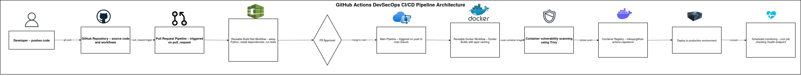
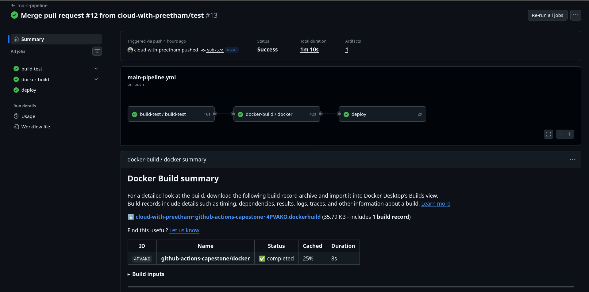

# GitHub Actions DevSecOps CI/CD Pipeline


A production-style **DevSecOps CI/CD pipeline** that automates application testing, containerization, security scanning, and deployment using **GitHub Actions**.

This project was created as part of the **GitHub Actions Capstone Project (Day 48)**.

---

# Project Goal

Build a **complete CI/CD pipeline with integrated security checks** using GitHub Actions.

The pipeline automatically performs:

- Application testing
- Docker image builds
- Container vulnerability scanning
- Image publishing to Docker Hub
- Deployment simulation
- Scheduled health monitoring

---

# S.T.A.R Explanation

## S — Situation

Traditional CI pipelines focus mainly on building and testing applications.

Security validation is often performed late in the development lifecycle, increasing the risk of vulnerabilities reaching production.

Containerized deployments also require automated validation to ensure security and reliability.

---

## T — Task

Design and implement a **DevSecOps CI/CD pipeline** using GitHub Actions that:

- Automates testing and build validation
- Integrates security scanning into the pipeline
- Containerizes the application
- Publishes Docker images
- Deploys and monitors the application automatically

---

## A — Action

- Built a **Python Flask application** with a `/health` endpoint.
- Created reusable GitHub Actions workflows for **build/test** and **Docker operations**.
- Implemented a PR validation pipeline.
- Integrated **Trivy container vulnerability scanning**.
- Built and pushed container images to **Docker Hub**.
- Implemented a scheduled **health check workflow** to monitor application availability.

---

## R — Result

- Delivered a fully automated **DevSecOps CI/CD pipeline**.
- Integrated security checks before deployment.
- Enabled automated container builds and image publishing.
- Created a **portfolio-ready project demonstrating CI/CD + DevSecOps practices**.

---

# Why This Project Matters

Modern DevOps pipelines must integrate **security directly into the CI/CD lifecycle**.

This project demonstrates how to implement a DevSecOps workflow using GitHub Actions where:

- Code validation
- Containerization
- Security scanning
- Deployment
- Monitoring

are automated inside the CI/CD pipeline.

---

# Key Features

- Flask-based Python web application
- Automated build and test workflow
- Docker container build using Buildx
- Container vulnerability scanning using **Trivy**
- Docker Hub image publishing
- Environment-based deployment stage
- Scheduled health check monitoring

---

# Architecture

```text
Developer Push
      |
      v
GitHub Repository
      |
      v
PR Pipeline (Build & Test)
      |
      v
Merge to main
      |
      v
Main Pipeline
      |
      +--> Docker Build
      +--> Trivy Security Scan
      +--> Docker Push
      |
      v
Deploy
      |
      v
Scheduled Health Check
```

---

# Pipeline Stages

Primary workflow files:

```text
.github/workflows/pr-pipeline.yml
.github/workflows/main-pipeline.yml
.github/workflows/health-check.yml
```

Pipeline stages include:

1. **build-test** – setup Python and run tests
2. **docker-build** – build container image
3. **security-scan** – scan image using Trivy
4. **docker-push** – push image to Docker Hub
5. **deploy** – simulate production deployment
6. **health-check** – scheduled monitoring workflow

---

# Tech Stack

| Category            | Tools                    |
| ------------------- | ------------------------ |
| Application Runtime | Python, Flask            |
| CI/CD               | GitHub Actions           |
| Containers          | Docker, Docker Hub       |
| Security Scanning   | Trivy                    |
| Automation          | Bash                     |
| Monitoring          | Scheduled GitHub Actions |

---

# Security Tools Used

This project integrates security checks inside the CI/CD pipeline.

- **Trivy** – Container vulnerability scanning
- **Docker Buildx** – secure container builds
- **GitHub Secrets** – secure credentials management

The pipeline fails if **CRITICAL vulnerabilities** are detected.

---

# Project Structure

```text
github-actions-capestone/
│
├── app/
│   ├── app.py
│   └── requirements.txt
│
├── docker/
│   └── Dockerfile
│
├── tests/
│   └── test.sh
│
├── docs/
│   └── pipeline-architecture.png
│
├── .github/workflows/
│   ├── reusable-build-test.yml
│   ├── reusable-docker.yml
│   ├── pr-pipeline.yml
│   ├── main-pipeline.yml
│   └── health-check.yml
│
└── README.md
```

---

# API Endpoint

| Endpoint  | Method | Description                |
| --------- | ------ | -------------------------- |
| `/health` | GET    | Returns application status |

Example response:

```json
{
  "status": "ok"
}
```

---

# Run Locally

Install dependencies:

```bash
pip install -r app/requirements.txt
```

Run the application:

```bash
python app/app.py
```

Open in browser:

```
http://localhost:5000/health
```

---

# Run with Docker

Build container image:

```bash
docker build -t github-actions-capestone -f docker/Dockerfile .
```

Run container:

```bash
docker run -p 5000:5000 github-actions-capestone
```

---

# GitHub Actions Setup

To run the full pipeline configure:

Repository Variables:

```
DOCKER_USERNAME
```

Repository Secrets:

```
DOCKER_TOKEN
```

Triggers:

- Pull requests trigger **PR validation pipeline**
- Push to `main` triggers **full CI/CD pipeline**

---

# Security Artifacts

Security scanning is performed using **Trivy**.

Detected vulnerabilities include:

- OS package vulnerabilities
- Container library CVEs
- dependency vulnerabilities

---

# Screenshots

## DevSecOps Architecture Diagram



## GitHub Actions Pipeline



---

# Future Improvements

- Add Kubernetes deployment
- Add infrastructure provisioning with Terraform
- Add Slack notifications
- Add monitoring integrations (Prometheus/Grafana)

---

# Author

**Preetham Pereira**

DevOps & Cloud Enthusiast

GitHub: https://github.com/cloud-with-preetham

---

# Tags

#DevOps
#GitHubActions
#DevSecOps
#CI_CD
#Docker
#CloudComputing
